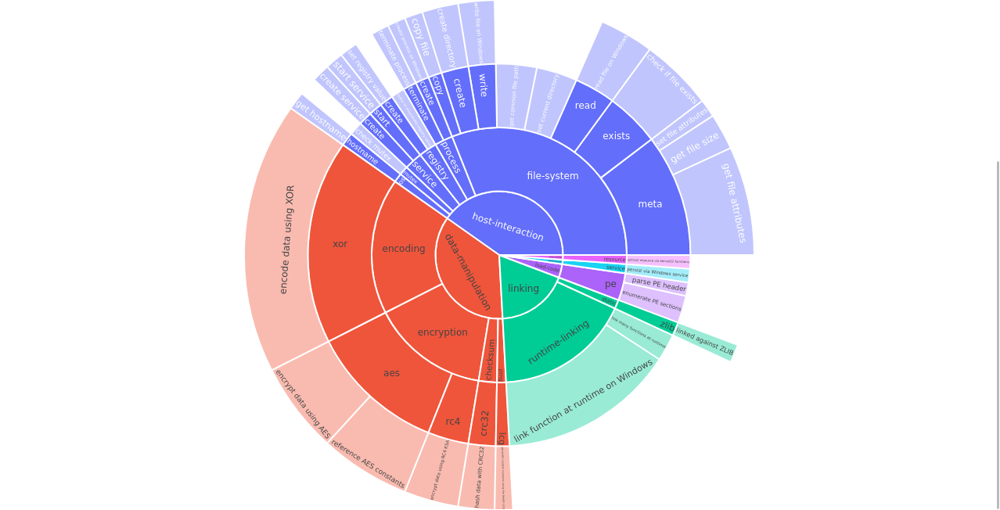
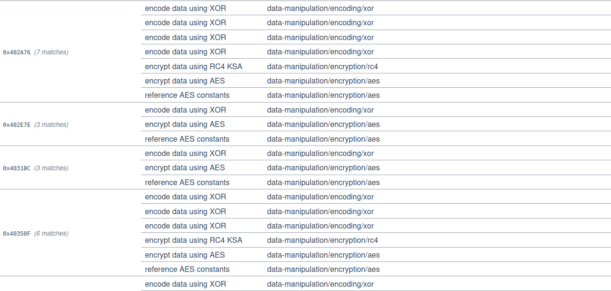
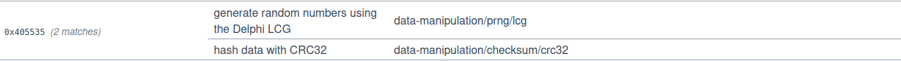

# WannaCry Capa Report

This is a quick report comparing  techincal reports of WannaCry with a generated Capa report.

By analyzing this capa report, it is possible to determine specific techinal features. 

## Overall Calls

As shown by this overall system call pie chart, it is obvious that the primary function of this program
is to navigate a filesystem and encrypt files. 

This tracks with the purpose of *WannaCry*, as this is ransomeware. 

The amount of *Xor* encryption also flags this as malware, as I believe *WannaCry* uses this encryption to obfuscate it's launcher and shell code before execution, as per Blackberry's threat spotlight. [source](https://blogs.blackberry.com/en/2017/06/threat-spotlight-inside-the-wannacry-attack)

## In Depth Calls

### Encryption

For this portion, I will be comparing this [Secure Works Analysis](https://www.secureworks.com/research/wcry-ransomware-analysis) from Secureworks with the capa report and this [Blackberry Analysis](https://blogs.blackberry.com/en/2017/06/threat-spotlight-inside-the-wannacry-attack).

According to the Secureworks, the malware uses both RSA and AES encryption for the files, which can be see here.

This is rather obvious though, more detailed functionality can be seen within the capa report.

### Random Number Generation
According to the Secure Work's report, 

>WCry creates a batch file using a randomly generated large integer (e.g., 46631494859358.bat, 37061494619317.bat) that creates a shortcut to the malware executable (see Figure 3).

We can see the use of an LCG [wikipedia to lcg](https://en.wikipedia.org/wiki/Linear_congruential_generator) to generate a random number, which could be the one used to create the shortcut.

### File Attributes

Throughout the capa report, we see many calls to get file attributes. This can be used for a variet of purposes that are stated throughout the analysis. Some use cases could be getting file lengths, targeting specific file extensions, and finding whitelisted directory names.

### Registry Editing

According to the Blackberry Report,
> This thread is responsible for calling the taskse.exe utility, which will try to enumerate active RDP sessions and run a process passed as the first parameter (in this case WanaDecryptor.exe) on connected remote machines (Fig. 27). The persistence of RDP injections is ensured by adding the appropriate value in the autorun registry key:

We can see this registry edit here...

###  Zlib

From Blackberry's Report,

>  s.wnry - ZIP archive containing Tor:
>-  Data/Tor/ (empty)
>-  Tor/libeay32.dll
>-  Tor/libevent_core-2-0-5.dll
>-  Tor/libgcc_s_sjlj-1.dll
>-  Tor/ssleay32.dll
>-  Tor/zlib1.dll
>-  Tor/libevent-2-0-5.dll
>-  Tor/libevent_extra-2-0-5.dll
>-  Tor/libssp-0.dll
>-  Tor/tor.exe
>-  (Same hashes as files contained in the official troproject archive:
>-  hxxps://dist.torproject(dot)org/torbrowser/6.5.1/tor-win32-0.2.9.10.zip)

The malware contains a zip archive containing TOR. We can see the zlib.dll found in the zip archive here...

## Conclusion
This was an incredible exercise in understanding how capa finds functionality without running the pogram itself. These capa reports could be used to build incredibly detailed capa-rules, which could help prevent attacks from this malware or malware that runs similarly. 

